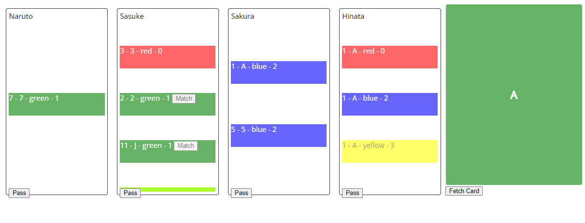

## Project Setup

```sh
npm install
```

### Compile and Hot-Reload for Development

```sh
npm run dev
```

### Game Interface:

Repo used as a package: [Blazing8S Structure](https://github.com/pkkarn/Blazing8S)



### Todo

- [ ] hide pass button if player is not active.
- [ ] In case of 8 regardless of what color and code it is, Just let the player throw.
- [ ] Stop and end game if any player has drawn all the cards
- [ ] Don't let player pass if he hasn't fetched any card from deck.